# Preliminaries

---



-- @NYU_Health_Sciences_Library2013-gp

---

```{r}
#| label: fig-cog-bbag-talk-qr
#| fig-cap: "<https://gilmore-lab.github.io/2026-09-30-cognitive-bbag/>"
plot(qrcode::qr_code("https://gilmore-lab.github.io/2026-09-30-cognitive-bbag/"))
```

## Agenda

- My (not so) hidden one
- How (to share)
- Where (to share)
- What (to share)
- The future of open psychological science

# My (not so) hidden agenda

## 

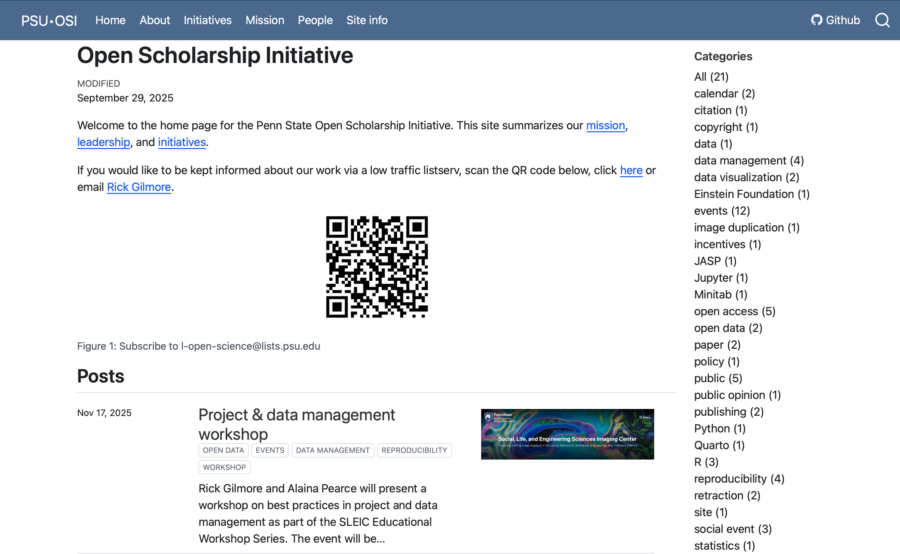{#fig-osi-page width="85%"}

## Data sharing requires

::: {.incremental}
- Best practices in project management
- $+$ Data management 
- $\rightarrow$ Sharing
:::

## Sharing...

- Accelerates discovery
- Bolsters credibility

## ...is an ethical thing to do

>Whereas regulators of human subjects research often view data sharing solely in terms of potential risks to subjects, we argue that the **principles of human subject research require an analysis of both risks and benefits**...

-- @Brakewood2013-wj

## 

>...such an analysis suggests that **researchers may have a positive duty to share data** in order to maximize the contribution that individual participants have made.

-- @Brakewood2013-wj

## Ethical data sharing

:::: {.columns}
::: {.column width=50%}
- **F**indable
- **A**ccessible
- **I**nteroperable
- **R**eusable

-- @Wilkinson2016-qr
:::
::: {.column width=50%}
{#fig-care-principles width="75%"}
:::
::::

## {auto-animate=true}

{#fig-tenopir-2020-fig-7 width="75%"}

## {auto-animate=true}

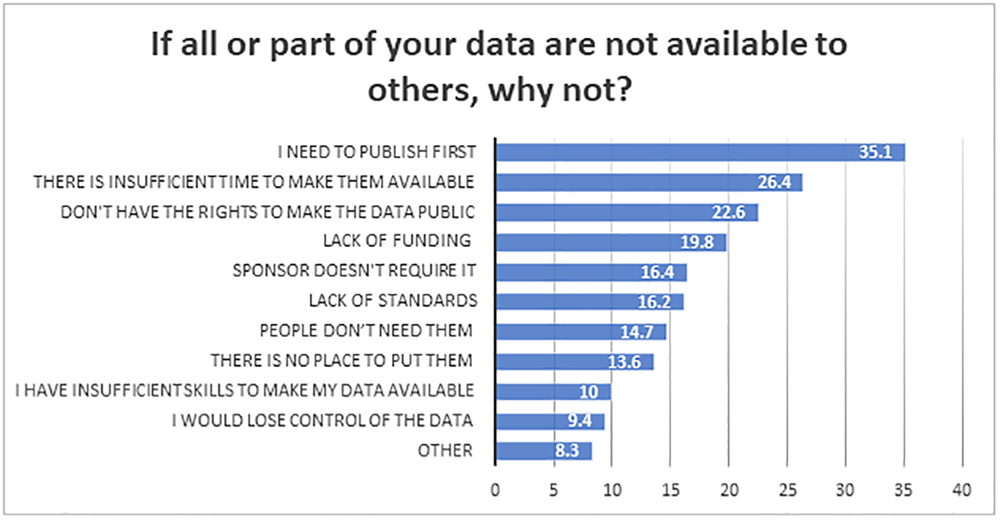{width="150%"}

## {auto-animate=true}

:::: {.columns}
::: {.column width=60%}

:::
::: {.column width=40%}
::: {.fragment}
- Must publish first
- No time, funding
- No permission
- Not required
- No place to put
- Insufficient skills
:::
:::
::::

---

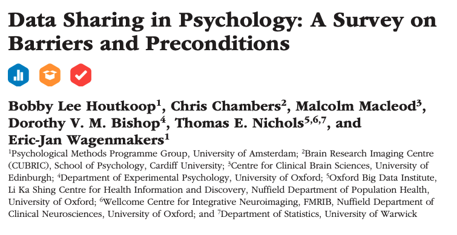

---

{fig-align="center" #fig-yoda-fear-in-you width="75%"}

## {auto-animate=true}

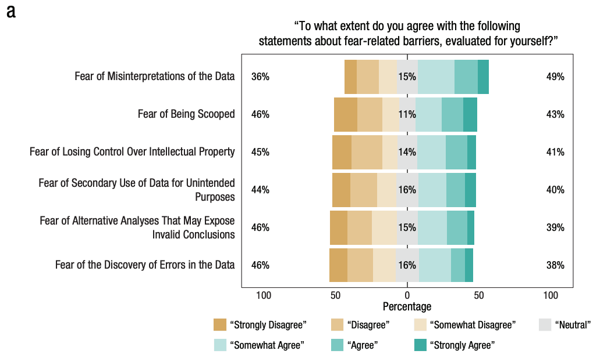

## {auto-animate=true}

:::: {.columns}
::: {.column width=60%}

:::
::: {.column width=40%}
::: {.fragment}
- Misinterpretations of the data
- Scooped
- Control over intellectual property
- Unintended secondary use
- Expose invalid conclusions, errors
:::
:::
::::

## {auto-animate=true}


## {auto-animate=true}

:::: {.columns}
::: {.column width=60%}

:::
::: {.column width=40%}
::: {.fragment}
- Expose invalid conclusions
- Control over intellectual property
- Discover errors
- Misinterpretation
:::
:::
::::

## Mitigating

:::: {.columns}
::: {.column width=50%}
- Errors
  - Quality assurance testing and validation
  - Automated data cleaning, visualization, analysis
- Control over IP^[You don't own your data, anyway.], fear of being scooped
  - Publish your data
  
:::
::: {.column width=50%}

:::
::::

## "How likely are you to share your research data..." {auto-animate=true auto-animate-easing="ease-in-out"}

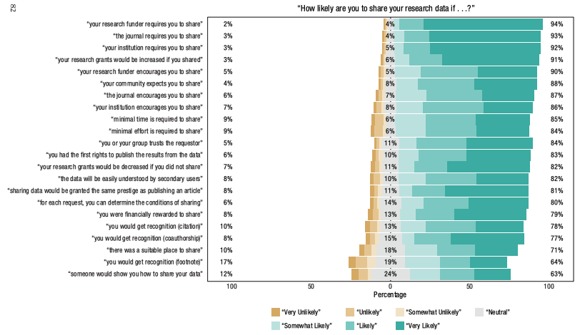{#fig-houtkoop-2018-04}

## {auto-animate=true auto-animate-easing="ease-in-out"}

:::: {.columns}
::: {.column width=60%}

:::
::: {.column width=40%}
::: {.fragment}
- Required by funder, journal, institution
- Encouraged by funder, journal, institution
- Easy, shown how
- Garner citations, recognition, bigger/more grants
:::
:::
::::

## Funders think you should


---


## NIH Data Management and Sharing Plan (DMS)

> to promote the management and sharing of scientific data generated from NIH-funded or conducted research.

-- @National-Institutes-of-HealthUnknown-ys

## NIH Data Management and Sharing Plan (DMS)


## NIH Data Management and Sharing Plan (DMS)

- 2p DMS plan **required**
- Must justify reasons if not sharing
- Sharing plans become formal part of award agreement

---


---

:::: {.columns}
::: {.column width=60%}

:::
::: {.column width=40%}
- *Required by funder*, journal, institution
- *Encouraged by funder*, *journal*, *institution*

::: {.incremental}
- **Easy, shown how**
- **Garner citations, recognition, bigger/more grants**
:::
:::
::::

# How

---

{#fig-giphy-messy-room width="65%"}

---

{#fig-we-are-too-busy}

## Pay me now, or pay me later



-- @PathfindersPerform2013-cy

## Principles

- Plan your work, work your plan
- "Good enough" practices
- Document
- Automate
- Get credit

## Plan your work

```{mermaid}
%%| label: fig-proposal-to-project
%%| fig-cap: "From proposal to project"
flowchart LR
  A(["Idea"]) --> B["Proposal"]
  B --> C("Project_1")
  B --> D("Project_2")
  D --> E("Paper_2")
  C --> F("Paper_1")
  E --> G("Fame & Glory")
  F --> G
```

---

```{mermaid}
%%| label: fig-proposal-to-project-realistic
%%| fig-cap: "From proposal to project: More realistic"
flowchart LR
  A(["Idea"]) --> B["Proposal"]
  B --> C("Project_1")
  B --> D("Project_2")
  B --> I("IRB protocol")
  G(["Data mgmt plan"]) --> B
  G <--> I
  C --> I
  D --> I
  D --> E("Paper_2")
  C --> F("Paper_1")
```

---

```{mermaid}
%%| label: fig-one-project
%%| fig-cap: "One project workflow"
flowchart LR
  A["Project_1"] --> B["Survey"]
  A --> C["fMRI"]
  A --> D["Task_1"]
  A --> E["Task_2"]
  B --> P["Data_pipeline_1"]
  C --> Q["Data_pipeline_2"]
  D --> R["Data_pipeline_3"]
  E --> R
  F["Data mgmt plan"] --- B & C & D & E & P & Q & R
  P --> G["Analysis_1"]
  Q & R --> H["Analysis_2"]
  G & H --> I["Poster"]
  G & H --> J["Paper"]
```

---

```{mermaid}
%%| label: fig-one-project-w-sharing
%%| fig-cap: "Planned data sharing to a repository"
flowchart TD
  A["Project_1"] --> B["Survey"]
  A --> C["fMRI"]
  A --> D["Task_1"]
  A --> E["Task_2"]
  B --> P["Data_pipeline_1"]
  C --> Q["Data_pipeline_2"]
  D --> R["Data_pipeline_3"]
  E --> R
  F["Data mgmt plan"] --- B & C & D & E & P & Q & R
  P --> G["Analysis_1"]
  Q & R --> H["Analysis_2"]
  G & H --> I["Poster"]
  G & H --> J["Paper"]
  C & D & G & H & F --> K["Data repository"]
```

---

```{mermaid}
%%| label: fig-one-project-w-sharing-multirepo
%%| fig-cap: "Planned data sharing in multiple repositories"
flowchart LR
  A["Project_1"] --> B["Survey"]
  A --> C["fMRI"]
  A --> D["Task_1"]
  A --> E["Task_2"]
  B --> P["Data_pipeline_1"]
  C --> Q["Data_pipeline_2"]
  D --> R["Data_pipeline_3"]
  E --> R
  F["Data mgmt plan"] --- B & C & D & E & P & Q & R
  P --> G["Analysis_1"]
  Q & R --> H["Analysis_2"]
  G & H --> I["Poster"]
  G & H --> J["Paper"]
  B & C & D & G & H & F --> K["OpenNeuro"]
  B --> L["OSF"]
  K --- L
```

---

::: {.callout-important}
## Lesson learned

Plan your workflow in as much detail as you possibly can before you start.

:::

::: {.fragment}
::: {.callout-important}
## Lesson learned

Plans change.

So, evaluate, revise, and update.

Document what you changed, when, and why.

:::
:::

## Lessons learned

::: {.callout-note}
## Recommended practice

Version your protocol.

*Manual is fine*: e.g, `nsf-2412345-protocol-2025-12-02v01.docx`.

*Automated is better*: Google Docs keeps version histories. 
:::

::: {.fragment}

::: {.callout-important}
## Quarto rocks!

[](https://quarto.org)

enables the creation of git-versioned web sites as protocols, among other types of scholarly documents.

:::

:::

## Examples

- Open Scholarship Survey (2022-23)
  - [IRB protocol](https://penn-state-open-science.github.io/survey-fall-2022/hrp-591.html) + [data processing](https://penn-state-open-science.github.io/survey-fall-2022/data-gathering-and-cleaning.html) and [visualization pipeline](https://penn-state-open-science.github.io/survey-fall-2022/data-visualization.html)
- Play & Learning Across a Year (PLAY Project)
  - Project [site](https://play-project.org) and [protocol](https://play-project.org/collection.html)

---

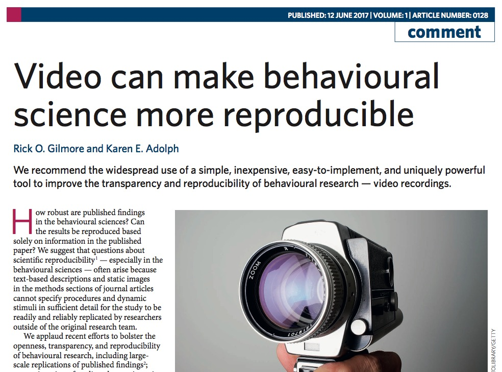{#fig-gilmore-adolph-video-can width="75%"}

---



-- @UnknownUnknown-vx

---



-- @UnknownUnknown-ik

---

:::: {.columns}
::: {.column width=50%}

:::
::: {.column width=50%}



:::
::::

-- @Gilmore2015-oj

---

::: {.callout-important}
## Lesson learned

Well-documented plans & practices can be reused for new projects.

Be kind to your future (forgetful) self.

:::

## Automate & Standardize

- Script/code *everything* you possibly can
  - Learn R, Python, shell scripting
  - You can do it!
  - Build things you actually need
  
## Automate & Standardize

```bash
# These are bash shell commands
mkdir -p project/{admin,protocol,data}
mkdir -p project/admin/{financial,irb,meeting_documents,recruitment,research_assistants}
mkdir -p project/data/sub-control01/{anat,func,dwi,fmap}
```

## Automate & Standardize

{#fig-project-mgmt-directory-structure width="75%"}

## Automate & Standardize

- Capture data in electronic form as much as possible
  - e.g., Qualtrics, Google Forms, REDCap, [KoBoToolbox](https://kobotoolbox.org)
- Let the computer do tedious, repetitive, error-prone work
  - e.g., data export & cleaning
  - Code as documentation

## Examples

- Project-specific R packages (A. Pearce)
- [REDcap](https://project-redcap.org) to capture project metadata
- Executable [Quarto](https://quarto.org) documents
  - Bootcamp 2026 [site](https://penn-state-open-science.github.io/bootcamp-2026/)
  - Bootcamp 2026 Workshops [I](https://penn-state-open-science.github.io/bootcamp-2026-quarto-I/) and [II](https://penn-state-open-science.github.io/bootcamp-2025-quarto-II/)
  - Open Scholarship [Survey](https://penn-state-open-science.github.io/survey-fall-2022/)

## Common themes

- Raw data live in secure place
- Use API calls to gather, clean, process

::: {.fragment}
::: {.callout-important}
## (Painful) lesson learned

APIs can change, so be prepared to update your procedures & code.

:::
:::

# Where

## Big picture

- Privacy & permission
- AI and IP
- Type(s) of data
- Repositories
- *Data papers*

## Privacy & permission

- Ask your participants
- Broad consent vs. narrow
- Store sharing permission & consider sharing it
- Pseudo-anonymizing
  - May or may not be required
  
## AI and IP

- Sharing data, protocols, metadata, code publicly means
- Anyone can mine & use, including AI agents
  - Will you get credited/cited properly?
- Alternative: Restricted access sharing

## Type(s) of data

- Imaging data
- Non-identifiable
- Identifiable

## Imaging data 

:::: {.columns}
::: {.column width=40%}
- [OpenNeuro](https://openneuro.org)
- Use [BIDS](https://bids.neuroimaging.io)
:::
::: {.column width=60%}
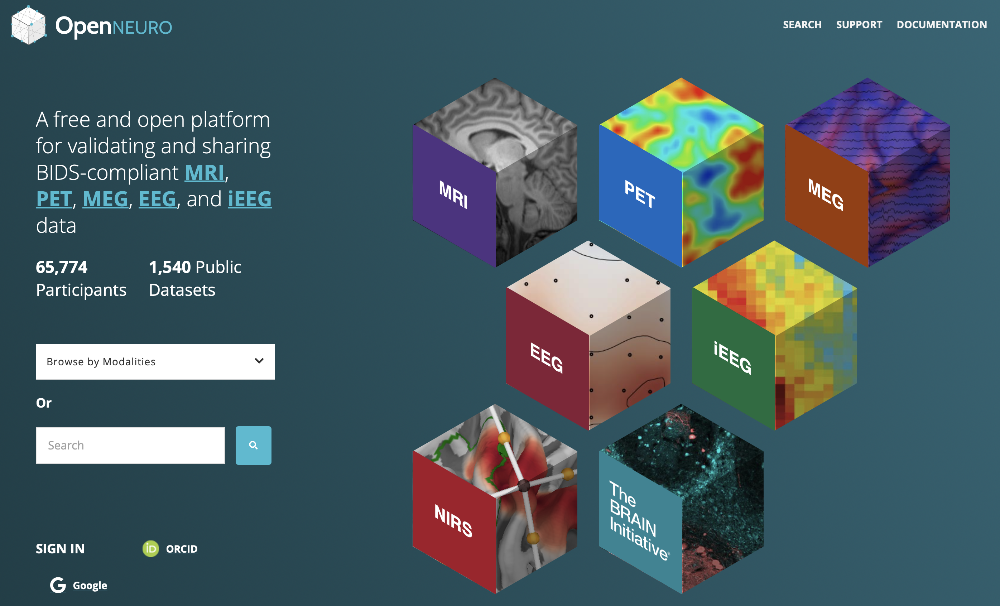{#fig-openneuro}
:::
::::

## Imaging data

:::: {.columns}
::: {.column width=40%}
- Use [BIDS](https://bids.neuroimaging.io)
:::
::: {.column width=60%}
{#fig-bids}
:::
::::

## Non-identifiable data

:::: {.columns}
::: {.column width=40%}
- [Level 1](https://security.psu.edu/awareness/icdt/) in Penn State's data classification
- PSU's [ScholarSphere](https://scholarsphere.psu.edu)
:::
::: {.column width=60%}
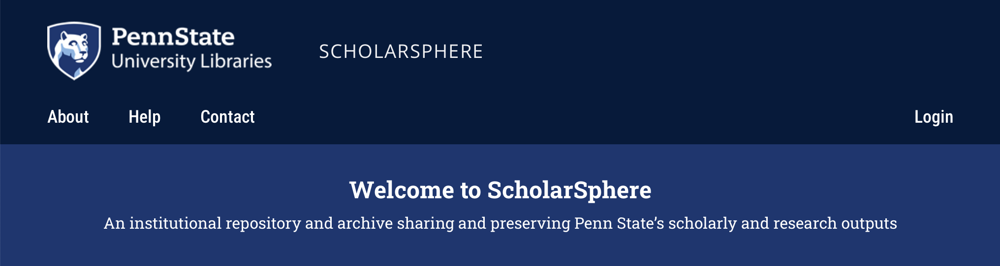{#fig-scholarsphere}
:::
::::

## Non-identifable data

:::: {.columns}
::: {.column width=40%}
- [~~Open Science Framework (OSF)~~](https://osf.io)
:::
::: {.column width=60%}
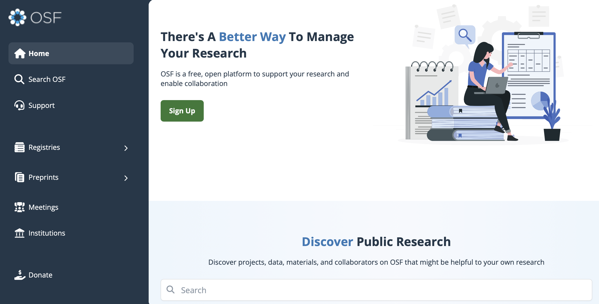
:::
::::

## Identifiable data

:::: {.columns}
::: {.column width=50%}
- [Inter-university Consortium for Political and Social Research (ICPSR)](https://www.icpsr.umich.edu/sites/icpsr/home)
:::
::: {.column width=50%}

:::
::::
  
## Identifiable data

:::: {.columns}
::: {.column width=50%}
- Especially video & audio^[Plus birth dates, test dates, address/geo information.]
- Can be shared *unaltered*
:::
::: {.column width=50%}

:::
::::

# 

](https://databrary.org/assets/logo-nav-dQIvaOqh.svg)

## What is it?

- Data library
- Housed at NYU
- Specialized for storing, sharing *identifiable data*


## How!?

- Restricted access
- Explicit sharing release from participants/parents/staff
- Institutional agreements

## Restricted access

```{r}
#| message: false
#| include: false
library(databraryr)

login_db(email = Sys.getenv("DATABRARY_LOGIN"),
         password = Sys.getenv("DATABRARY_PASSWORD"),
         client_id = Sys.getenv("DATABRARY_CLIENT_ID"),
         client_secret = Sys.getenv("DATABRARY_CLIENT_SECRET"),
         store = FALSE,
         overwrite = FALSE)
```

```{r}
#| echo: true
release_levels <- databraryr::get_release_levels()
```

:::: {.columns}
::: {.column width=50%}
- *Private*: Accessible only to data owner + people supervised by owner
- *Authorized Users*: Accessible to Authorized Users (for broad research reuse)
:::
::: {.column width=50%}
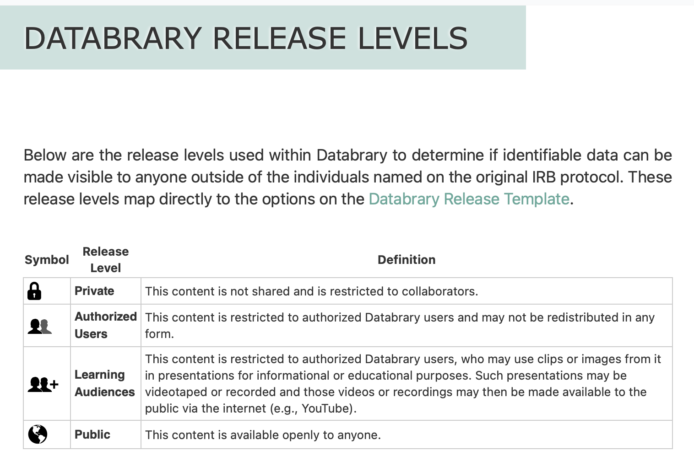
:::
::::

## Restricted access

:::: {.columns}
::: {.column width=50%}
- *Learning Audiences*: Accessible to Authorized Users (for broad research reuse) + permission to show clips in public talks
- *Public*: Accessible to anyone (e.g., non-identifiable displays)
:::
::: {.column width=50%}

:::
::::

## Explicit sharing permission

:::: {.columns}
::: {.column width=50%}
- Adult & minor parent/guardian [permission](https://databrary.org/support/irb/release-template)
- Child assent
- [Research staff](https://databrary.org/support/irb/staff-agreement)
- Release [script](https://databrary.org/support/irb/script)
:::
::: {.column width=50%}
::: {.fragment}

:::
:::
::::

## By the numbers

```{r}
#| echo: true
db_stats <- databraryr::get_db_stats()
```

- *N*=`{r} db_stats$institutions` institutions
- *N*=`{r} format(db_stats$investigators, big.mark = ",")` institutionally-authorized investigators
- *N*=`{r} db_stats$affiliates` staff & trainees
- *N*=`{r} format(db_stats$hours_of_recordings, big.mark = ",")` hours of shared recordings

## Databrary @ Penn State {.scrollable}

:::: {.columns}
::: {.column width=50%}
```{r}
#| echo: true
psu_info <- get_institution_by_id(institution_id = 12)
if (psu_info$has_avatar) {
  avatar_fn <- get_institution_avatar(12, dest_path = "tmp/psu_avatar.png")
}
```

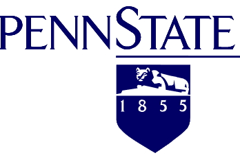{#fig-map fig-align="left"}
:::
::: {.column width=50%}
```{r}
#| echo: true
#| label: fig-map-lat-lon
#| fig-cap: "A map generated via lat/lon data provided via the Databrary API."

lat <- as.numeric(psu_info$latitude)
lon <- as.numeric(psu_info$longitude)
library(leaflet)
leaflet() %>%
  addTiles() %>%  # Adds the default OpenStreetMap map background
  addMarkers(lng = lon, lat = lat, popup = "We are...")
```
:::
::::

## Researchers @ Penn State {.scrollable}

```{r}
#| echo: true
psu_ais <- list_institution_affiliates(institution_id = 12)
```

- There are *n*=`{r} dim(psu_ais)[1]` *Authorized Investigators*

---

```{r}
library(kableExtra)
psu_ais |>
  dplyr::select(user_id, user_prename, user_sortname) |>
  dplyr::rename(id = user_id, first = user_prename, last = user_sortname) |>
  kableExtra::kable() |>
  kable_styling("striped", full_width = FALSE) %>%
  scroll_box(width = "900px", height = "600px")
```

## Data @ Penn State

```{r}
#| echo: true
source("R/get_institution_user_stats.R")
psu_stats <- get_institution_statistics(12)
psu_user_stats <- get_institution_user_stats(12)
user_uploaded_data_footprint <- sum(psu_user_stats$uploaded_data_footprint)
user_uploaded_n_files <- sum(psu_user_stats$files_number)
user_volumes_number <- sum(psu_user_stats$volumes_number)
```

- Researcher "owned"^[Under PSU policy, researchers do not own their data. See [RP15](https://policy.psu.edu/policies/rp15).]
  - `{r} format(user_uploaded_data_footprint/1e9, digits = 4, big.mark = ",")` GB of data, *n*=`{r} format(user_uploaded_n_files, digits = 5, big.mark = ",")` files in *n*=`{r} format(user_volumes_number, digits = 3, big.mark = ",")` volumes/datasets
- Institutionally "owned"^[Investigator(s) no longer affiliated with Penn State.]
  - `{r} format(psu_stats$uploaded_data_footprint/1e9, digits = 4, big.mark = ",")` GB, *n*=`{r} format(psu_stats$files_number, digits = 5, big.mark = ",")` files in *n*=`{r} format(psu_stats$volumes_number, digits = 3, big.mark = ",")` volume/dataset
  
## Examples

## New features

- Secure API for scriptable interactions (up/download)^[NSF 244730]
  - *databraryr* (R)
  - *databrarypy* (Python)
- Custom collections
  - Curate your own set of clips, datasets^[NSF 244730]
- External integrations
  - Add geographically-informed data from U.S. Census^[In collaboration with [The ARDA](https://thearda.org); financial support from the John S. Templeton Foundation.]
  
# Play & Learning Across a Year (PLAY)

---



---

:::: {.columns}
::: {.column width=50%}
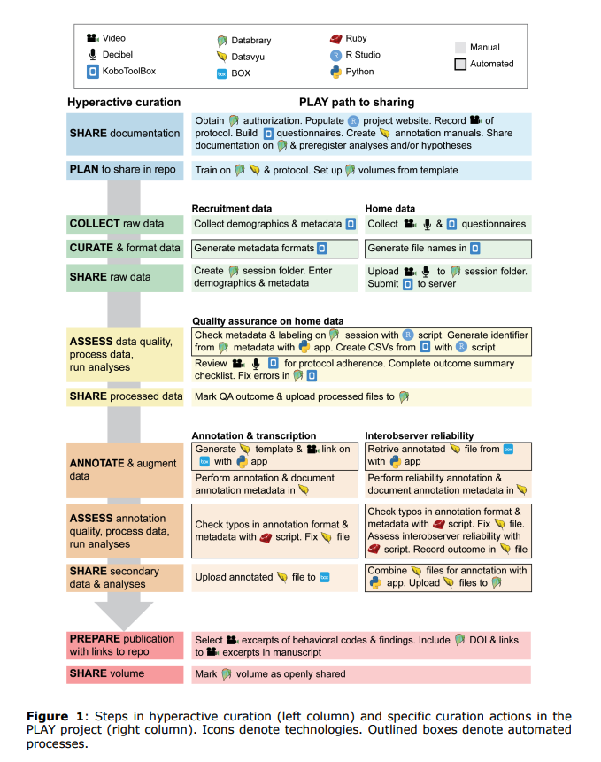
:::
::: {.column width=50%}
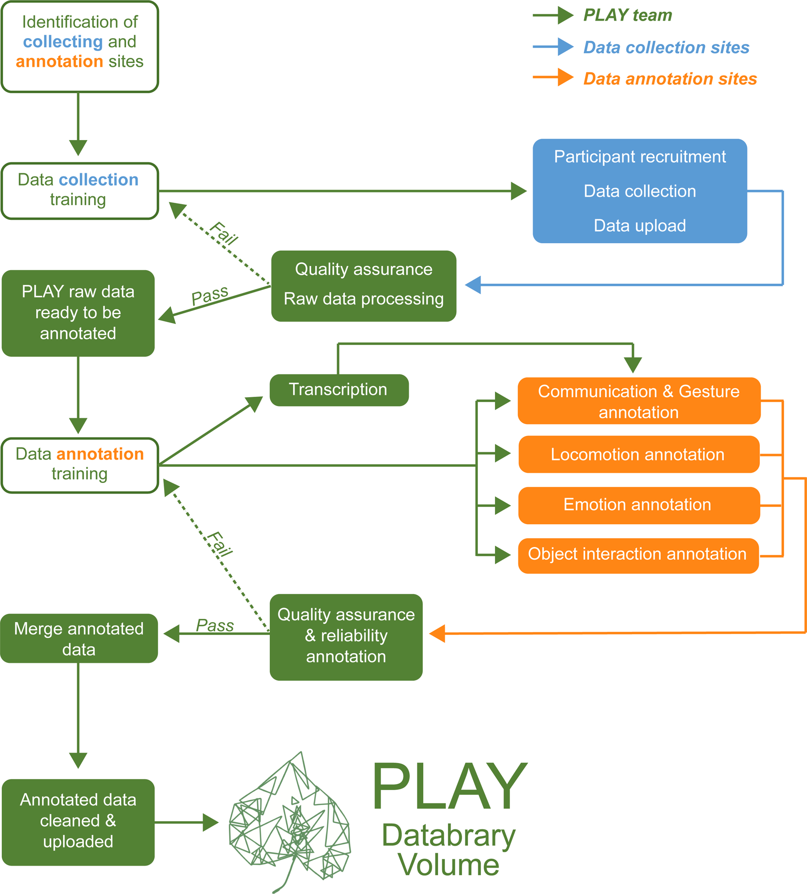
:::
::::

## Dataset

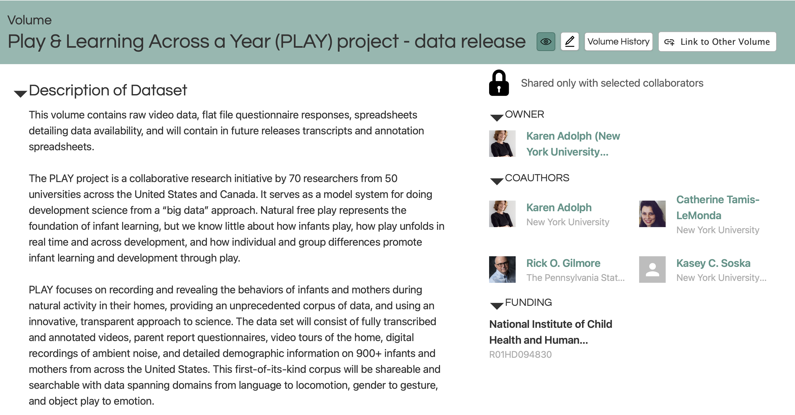{#fig-embargoed-data-release}

## PLAY Summary

```{r}
#| label: play-csv-data
library(ggplot2)
library(dplyr)
library(forcats)
library(readr)
library(stringr)

play_df <- readr::read_csv("private/csv/Play_&_Learning_Across_a_Year_(PLAY)_project_-_data_release.csv")

play_df <- play_df |>
  mutate(particip_id = stringr::str_extract(file_name, "[A-Z]{5}_[0-9]{3}"))
```

```{r}
#| label: play-data-n-files
play_summ_n_files_df <- play_df |>
  group_by(particip_id) |>
  summarise(n_files = n())
```

- *N*=`{r} dim(play_summ_n_files_df)[1]` participant dyads
- *N*=`{r} format(sum(play_summ_n_files_df$n_files), big.mark = ",", digits = 4)` shared files

## PLAY sharing permission

```{r}
#| label: fig-play-data-release
#| fig-cap: "Sharing permissions granted for PLAY corpus."
play_summ_release_df <- play_df |>
  select(particip_id, container_release_level) |>
  rename(sharing = container_release_level) |>
  distinct()

play_summ_release_df |>
  mutate(sharing = fct_rev(fct_inorder(sharing))) |>
  ggplot() +
  geom_bar(aes(x = sharing, fill = sharing), stat = "count") +
  coord_flip() +
  theme_classic() +
  theme(legend.position = "n") +
  ylab("dyads") +
  xlab("")
```

## PLAY demographics

```{r}
#| label: play-data-demog
#| echo: true
play_summ_demog_df <- play_df |>
  select(
    particip_id,
    `participant-1-gender`,
    `participant-1-race`,
    `participant-1-ethnicity`,
    `participant-1-language`
  ) |>
  distinct() |>
  rename(
    ethnicity = `participant-1-ethnicity`,
    language = `participant-1-language`,
    gender = `participant-1-gender`,
    race = `participant-1-race`
  ) |>
  mutate(english = str_detect(language, "English"),
         spanish = str_detect(language, "Spanish"),
         both = str_detect(language, "English, Spanish"))
```

- Sex reported at birth:
  - `{r} sum(play_summ_demog_df$gender == "Female", na.rm = TRUE)` girls; `{r} sum(play_summ_demog_df$gender == "Male", na.rm = TRUE)` boys
- Languages spoken at home:
  - English: `{r} sum(play_summ_demog_df$english == TRUE, na.rm = TRUE)`
  - Spanish: `{r} sum(play_summ_demog_df$spanish == TRUE, na.rm = TRUE)`
  - Both English & Spanish: `{r} sum(play_summ_demog_df$both == TRUE, na.rm = TRUE)`
  
## PLAY demographics
  
```{r}
#| label: fig-play-demog-race
#| fig-cap: "Reported race for children in PLAY sample."
play_summ_demog_df |>
  filter(!is.na(race)) |>
  mutate(n_race = fct_rev(fct_infreq(race))) |>
  ggplot() +
  geom_col(aes(x = race, fill = race), stat = "count") +
  coord_flip() +
  theme_classic() +
  theme(legend.position = "none") +
  xlab("") +
  ylab("dyads")
```


# What to share

## Low hanging fruit

:::: {.columns}
::: {.column width=50%}
- Protocols
  - Text + images
  - Video
- Displays
  - Code^[On Github, Gitlab or other.]
  - Video
  
:::
::: {.column width=50%}
- Code
  - Data cleaning
  - Visualization
  - Analysis
- Data
  - Non-identifiable
  
:::
::::

## Low hanging fruit

- Pubs
  - Preliminary reports
  - Posters, preprints

## A (slightly bigger) lift

- Identifiable data
  - Video or audio recordings of individual sessions
  - Exact birth or test dates
  - Geographic information (e.g., address-related)

# The future of open psychological science

## Imagine...

:::: {.columns}
::: {.column width=50%}
- There's no paywalls
- No "data on request" promises
- Openly shared protocols
- Data documented, too...
:::
::: {.column width=50%}
![John Lennon; Wikipedia^[By Bob Gruen; Distributed by Capitol Records - Listen to This Press Kit (1974)Immediate (iHeart), Public Domain, https://commons.wikimedia.org/w/index.php?curid=175003052]](https://thumb.wikimedia.org/wikipedia/commons/thumb/8/85/John_Lennon_%22Walls_and_Bridges%22_1974_press_photo_2_%28color%29_%28cropped%29.jpg/1280px-John_Lennon_%22Walls_and_Bridges%22_1974_press_photo_2_%28color%29_%28cropped%29.jpg?utm_source=en.wikipedia.org&utm_campaign=imageinfo&utm_content=thumbnail){#fig-john-lennon-wikipedia width="75%"}
:::
::::

## Imagine...

- Every paper comes with openly shared data
  - Data papers^[e.g., *Scientific Data*] & preregistration standard
- Linked to protocols & code^[I favor [Quarto](https://quarto.org)] that can reproduce all statistical analyses and figures
- Openly shared videos of experiments, displays^[Remember [Clever Hans](https://en.wikipedia.org/wiki/Clever_Hans)?]
- Aggregation of datasets for meta/mega/multiverse analyses made *much* easier

## Imagine...

- Embedding *reproducibility* & *replication* into (undergrad & grad) curriculum [@Frank2012-fc]
  - Make data visualization & [management best practices](https://penn-state-open-science.github.io/posts/2025-11-17-sleic-workshop.html) prominent
  - 1st semester projects *reproduce* a prior analysis
  - 1-2 year/master's project conducts an exact^[As possible.] *replication*^[At least for the first study of a multi-study project]

## Opportunities

- Bring open practices into your lab group
  - Reproduce prior analyses, visualizations
  - Replicate prior findings first
  - Create open, versioned protocols
- Participate in Open Scholarship Initiative
  - Workshops
  - Bootcamp
  - Talks

## Opportunities

- Help Gilmore with open science projects
  - PLAY
      - Shiny app
      - New analysis of video data
      - Augment with geographically informed contextual data
  - How-to papers about *databraryr* or *databrarypy*
  - Mega-analysis of child visual acuity data

# Wrap-up

## Main points

- Openly sharing data, protocols, code is an investment in the future of discovery in psychological science
- Open sharing strengthens your research
- Restricted access sharing protects participants and their privacy
- Databrary enables open sharing of research data
- Join us in building a more open, transparent, robust, and reproducible future

# Resources

## References
